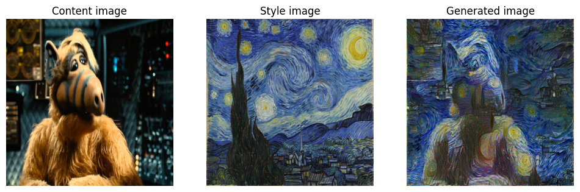

# Neural Style Transfer with TensorFlow
Implementation of the Neural Style Transfer algorithm using **TensorFlow** and the **VGG19** pre-trained network.

## 🎨 Project Overview
This project implements the **Neural Style Transfer** (NST) algorithm, originally proposed by [*Gatys et al.* (2015).](https://arxiv.org/abs/1508.06576)

NST is a deep learning optimization technique that combines the **content** of one image ($C$) with the **style** of another image ($S$). The goal is to generate a new image ($G$) that preserves the structural content of the first while adopting the artistic texture and appearance of the second.

## 🛠️ Tech Stack
* **Python 3**
* **TensorFlow 2 / Keras**
* **NumPy & Matplotlib**
* **PIL** (Python Imaging Library)

## 🖼️ Results

Below is the transformation process:

### 📝 Notes & Acknowledgments
* **Inspiration:** This project is heavily inspired by the *Art Generation with Neural Style Transfer* final lab from the **Convolutional Neural Networks** course by DeepLearning.AI.
* **Language:** Please note that while the Markdown explanations in the notebook are in Spanish, the code is in English.
